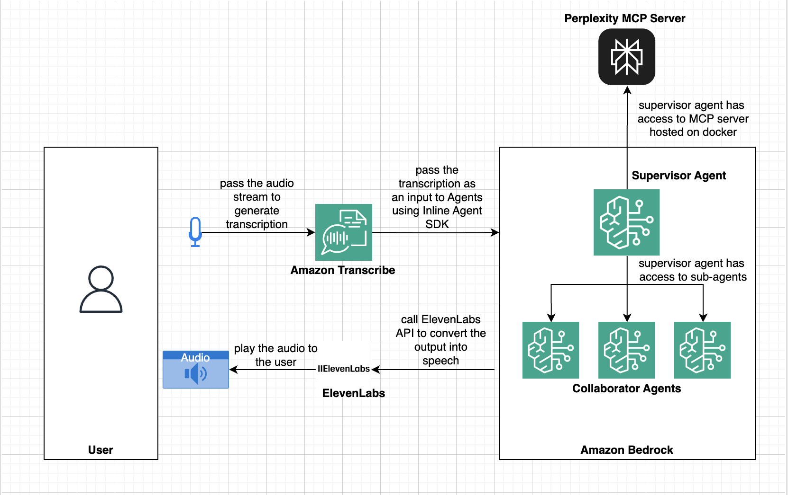

# Bangalore Travel Agent



An AI-powered travel assistant for Bangalore, built with Amazon Bedrock and Perplexity integration. This project provides witty, local travel advice, food recommendations, and real-time information via chat and voice.

## Features
- Chatbot with Bangalore-specific humor and deep local knowledge
- Collaborator agents for itinerary planning
- Web search integration via Perplexity
- Voice support using ElevenLabs API or browser fallback

## Setup Instructions

1. **Clone the repository**
   ```sh
   git clone https://github.com/jeerideka/amazon-bedrock-agent-samples.git
   cd amazon-bedrock-agent-samples/src/InlineAgent/examples/community/bangalore-travel-agent
   ```

2. **Install Python dependencies**
   ```sh
   pip install -r bangalore-travel-agent-frontend/requirements.txt
   ```

3. **Create your `.env` file**
   - Copy `.env.example` to `.env` and fill in your AWS and Perplexity credentials.

4. **Run the backend**
   ```sh
   python main.py
   ```

5. **Frontend Setup**
   - The frontend is in `bangalore-travel-agent-frontend/`
   - Install Node.js dependencies and run the development server:
     ```sh
     cd bangalore-travel-agent-frontend
     npm install
     npm run dev
     ```

## Usage
- Chat with the agent in your browser or via terminal.
- Use the voice feature for spoken responses (requires valid ElevenLabs API key or browser TTS support).

## Environment Variables
- `AWS_ACCESS_KEY_ID` and `AWS_SECRET_ACCESS_KEY` (for Bedrock)
- `PERPLEXITY_API_KEY` (for web search)
- `ELEVENLABS_API_KEY` (for voice, optional)

## Notes
- If you see a warning about an embedded git repo in the frontend, remove its `.git` directory before adding all files to your main repo.
- The agent uses Perplexity for live web search and ElevenLabs for high-quality voice. If ElevenLabs is unavailable, browser speech synthesis is used as fallback.

## Credits
Built as a community sample for Amazon Bedrock Agents and multi-agent collaboration.
